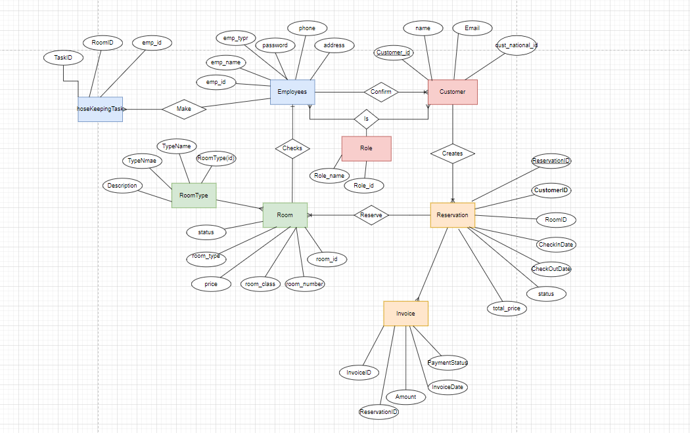

# Hotel Management System

This is the ERD for our Hotel Management System

This repository is for a Hotel Management System. It contains a Spring Boot applicaton that manages a hotel based on the provided data base schema. The project includes a docker configuration for easy setup and deployment. The API endpoints have been secured and swagger documentation is available.

These instructions will get you a copy of the project up and running on your local machine for development and testing purposes:

Prerequests:

<ul dir="auto">
    <li>
      
Java 17

    </li>
    <li>
      
Maven

    </li>
    <li>
      
Docker

    </li>
    <li>
      
Postman

    </li>
</ul>

Clone the Repository:

To clone the repository and navigate into the directory, run the following commands:

<ul>
    <li>
        git clone <a href="https://github.com/AlaYOD/Hotel-Management-System.git">https://github.com/AlaYOD/HotelManagement-System.git</a>
    </li>
    <li>
        
cd Hotel-Management-System

    </li>
</ul>

Building the Application:

To compile the source code, package the compiled code into a JAR file, and install the packaged code in your local repository:

mvn clean install

Creating and Running the Docker Image

To create a Docker image for the application, ensure Docker is running and execute:

docker build -t hotel-management-app .

This will build a Docker image named hotel-management-app.

To run the application in a Docker container:

docker run -p 8080:8080 hotel-management-app

The application will be accessible at <a href="http://localhost:8080" rel="nofollow">http://localhost:8080</a>.

Postman Collection

You can find the Postman collection for API testing in the repository. Download it and import into your Postman application for local testing.

API Documentation

You can find the API documentation at <a href="http://localhost:8080/swagger-ui.html" rel="nofollow">http://localhost:8080/swagger-ui.html</a> when the application is running. The documentation includes information about all endpoints, models, and authentication.

Security

This application uses JWT for securing the APIs. To get the token, use the /api/authenticate endpoint with the correct username and password.
Include the token in the Authorization header with the prefix "Bearer " in all requests.

Code Documentation

The source code is documented following Java best practices, which means each method, class, and module includes comments and descriptions of their functionality.

Setup the Application:

<ul dir="auto">
<li>

create a database named "hotel-management".

</li>
<li>

deploy the application

</li>
<li>

mvn clean

</li>
<li>

mvn install -DskipTests

</li>
<li>

Build the docker image

</li>
<li>

docker build -t hotel_management .

</li>
<li>

run the docker image:

</li>
<li>

docker run -p 8080:8080 -e SPRING_DATASOURCE_URL="jdbc:mysql://host.docker.internal:3306/hotel-management?useSSL=false&amp;useUnicode=true&amp;useJDBCCompliantTimezoneShift=true&amp;useLegacyDatetimeCode=false&amp;serverTimezone=UTC&amp;zeroDateTimeBehavior=convertToNull" -e SPRING_DATASOURCE_USERNAME=&lt;your_username&gt; -e SPRING_DATASOURCE_PASSWORD=&lt;your_password&gt; my-spring-app

</li>
</ul>
